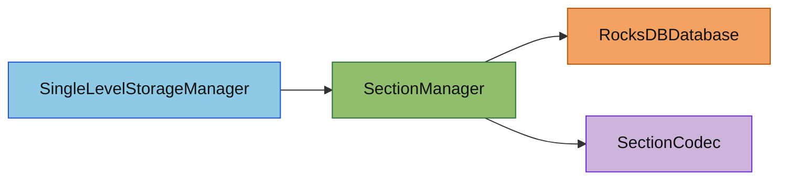

# Section 存储子模块

## 概述

`section/` 负责单维度 Section 数据的批量读取与批量写回，是 `SingleLevelStorageManager`
与 RocksDB 之间的直接桥梁。

本子模块的目标有两个：

1. 对同一维度下的多个 Section 读请求做聚合，一次 `MultiGet` 读完
2. 把整批待写段聚合成**一个** `WriteBatch` 提交，一次调用只付一次 WAL fsync

本子模块**不持有任何常驻缓存**。读写路径访问同一批段的概率极低，缓存只会常驻内存而不命中；
段数据的常驻副本由世界层的区块表承担，那里才掌握"当前哪些区块活着"的信息。

## 目录结构树

```text
section/
├── README.md                      # 本文档
├── SectionManager.hpp/cpp         # 单维度 Section 批量读写，不缓存任何数据
```

## 内部模块关系



## 上下游外部依赖关系

### 上游（谁依赖了这个模块）

- `SingleLevelStorageManager` - 通过 `SectionManager` 进行区块数据的读写

### 下游（这个模块依赖了谁）

- `db/RocksDBDatabase` - RocksDB 数据库封装
- `db/SectionCodec` - Section 序列化/反序列化
- `db/SectionKey` - Section 键结构
- `rocksdb` - RocksDB 库
- `spdlog` - 日志
- `perfetto` - 性能追踪

## 容易踩的坑

1. **批量读取只适用于同一个 `SectionManager`**：同一个 `SectionManager` 只服务一个 `DimensionId`，因此批量读取天然只覆盖同一维度下的同一列族。

2. **空指针只表示"Section 不存在"**：`loadSectionsSync()` 返回 `Result<std::vector<std::shared_ptr<const SectionData>>>`。外层失败表示系统级错误；外层成功但某个位置是空指针，才表示该 Section 不存在。

3. **批量读取返回顺序必须稳定**：上层 `loadChunk()` 依赖返回顺序与输入 `keys` 顺序一致，不能在实现里打乱顺序。

4. **写回必须聚合成单个 `WriteBatch`**：`saveSectionsBatch()` 把**全部**待写段攒进一个批再提交。逐段 `put` 会让每段各付一次 WAL fsync，视野距离 16 下 2048 个段实测约 6.6 秒，聚合后同一份数据只需几十毫秒。调用方（`ServerWorld::saveDirtyChunks`）同样要先把所有脏区块的段攒进同一个批次，否则会退化成"每区块一次 fsync"。

5. **`sync` 参数决定是否等落盘**：`saveSectionsBatch(writes, sync)` 的 `sync=true` 供关服与 `/save-all` 使用（返回即断电安全），其余情况传 `false` 交由一致性模式决定。自动保存传 `false`，避免周期性长阻塞。

6. **序列化只有一个入口 `SectionCodec::serializeFromChunkSection`**：它把 `SectionData` 的生命周期压在单次调用内（`blockStates` 是 4096 项 `u32`，即 16 KB/段；整列 24 段同时存活就是 384 KB），直接把 `ChunkSection` 变成落盘字节。所有写路径都必须经由它，否则不同路径产出的字节会不一致。

7. **本模块不缓存，不要把缓存加回来**：读路径与写路径访问同一批段的概率极低。历史上这里有一层 LRU（`SectionCache`），实测累计 13 万次查询命中 0 次——它只被保存路径回填、从未被读路径命中，纯属常驻内存浪费。段数据的常驻副本归世界层的区块表管理。
