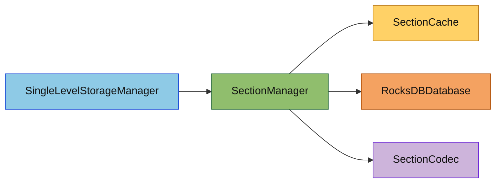

# Section 存储子模块

## 概述

`section/` 负责单维度 Section 数据的缓存、批量读取、写回和卸载协调，是 `SingleLevelStorageManager` 与 RocksDB 之间的直接桥梁。

本子模块的目标有三个：

1. 统一 Section 级缓存语义，避免运行时重复反序列化
2. 对同一维度下的多个 Section 读请求做聚合，优先命中缓存，未命中时走一次批量 DB 读取
3. 维护脏标记与批量刷盘流程，供自动保存和关闭流程复用

## 目录结构树

```text
section/
├── README.md                      # 本文档
├── SectionCache.hpp/cpp           # 线程安全 LRU 缓存，保存 SectionData、脏标记、访问统计
├── SectionManager.hpp/cpp         # 单维度 Section 管理器，负责加载/保存/缓存管理（全量/增量保存均聚合为 WriteBatch 提交）
```

## 内部模块关系



## 上下游外部依赖关系

### 上游（谁依赖了这个模块）

- `SingleLevelStorageManager` - 通过 `SectionManager` 进行区块数据的读写

### 下游（这个模块依赖了谁）

- `db/RocksDBDatabase` - RocksDB 数据库封装
- `db/SectionCodec` - Section 序列化/反序列化
- `db/SectionKey` - Section 键结构
- `task/StorageTaskManager` - 异步任务调度
- `rocksdb` - RocksDB 库
- `spdlog` - 日志
- `perfetto` - 性能追踪

## 容易踩的坑

1. **批量读取只适用于同一个 `SectionManager`**：同一个 `SectionManager` 只服务一个 `DimensionId`，因此批量读取天然只覆盖同一维度下的同一列族。

2. **空指针只表示”Section 不存在”**：`loadSectionsSync()` 返回 `Result<std::vector<std::shared_ptr<const SectionData>>>`。外层失败表示系统级错误；外层成功但某个位置是空指针，才表示该 Section 不存在。

3. **缓存命中和批量读取必须分开处理**：不要把所有 key 都无脑送进 `MultiGet`。正确做法是先查缓存，只把 miss 交给数据库。

4. **批量读取返回顺序必须稳定**：上层 `loadChunk()` 依赖返回顺序与 `sectionY` 顺序一致，不能在实现里打乱顺序。

5. **两条写回路径都必须聚合为 `WriteBatch`**：`MultiGet` 只优化读取；写路径的批量能力只有 `rocksdb::WriteBatch`。`flushDirtySections` 与 `saveAll` 都必须把**全部**待写段攒进一个批再提交——逐段 `put` 会让每次写入各付一次 fsync，视野距离 16 下 2048 个段实测约 6.6 秒，聚合后同一份数据只需几毫秒。`saveAll` 是关服/显式全量保存的落盘点，提交时固定 `sync=true`。

6. **缓存淘汰只由容量触发，与区块生命周期无关**：`SectionCache` 是纯 LRU，只在容量满时淘汰，**不会**因区块卸载而失效。而卸载前的异步保存会把整列 24 个段回填进缓存（`SectionManager::saveSectionSync` 末尾的 `m_cache.put`），因此卸载路径必须显式调用 `SingleLevelStorageManager::evictChunkSectionsFromCache()`（接入点在 `ServerChunkManager::_finalizeUnloadAfterSave`）。漏掉它，缓存常驻量会正比于「历史上加载过的区块」而非「当前已加载的区块」。

7. **`deleteChunkSections` 会删数据库，不可用于卸载**：名字容易误解——它逐个调用 `deleteSection`，是**真删库**（用于区块重生成等场景）。卸载需要的是「只驱逐缓存」，对应 `SectionManager::evictChunkFromCache()` / `SectionCache::evictChunk()`，二者不触碰数据库。

8. **`saveAll` 的契约是"无论是否脏都保存"**：它遍历缓存全量写入，因此即使所有段都已被标记为干净，第二次调用仍必须返回同样的条数。若为了"省事"改成只写脏段，`/save-all flush` 与关服就会静默少写数据。

9. **序列化只有一个入口 `_serializeSection`**：`computeHash` 开启时它会在本地副本上算哈希（绝不原地改缓存里的共享 `SectionData`）。`_saveToDatabase`、`flushDirtySections`、`saveAll` 三条写路径都必须经由它，否则同一份数据经不同路径落盘的字节会不一致。
