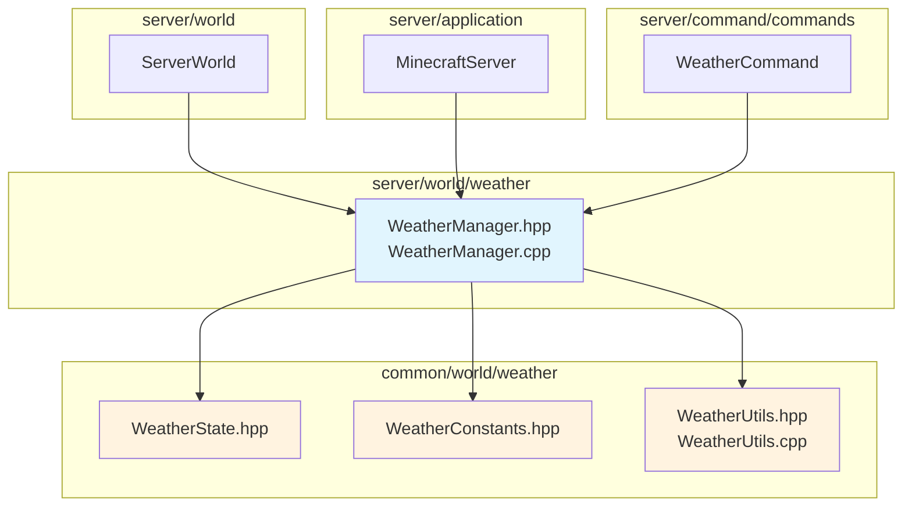
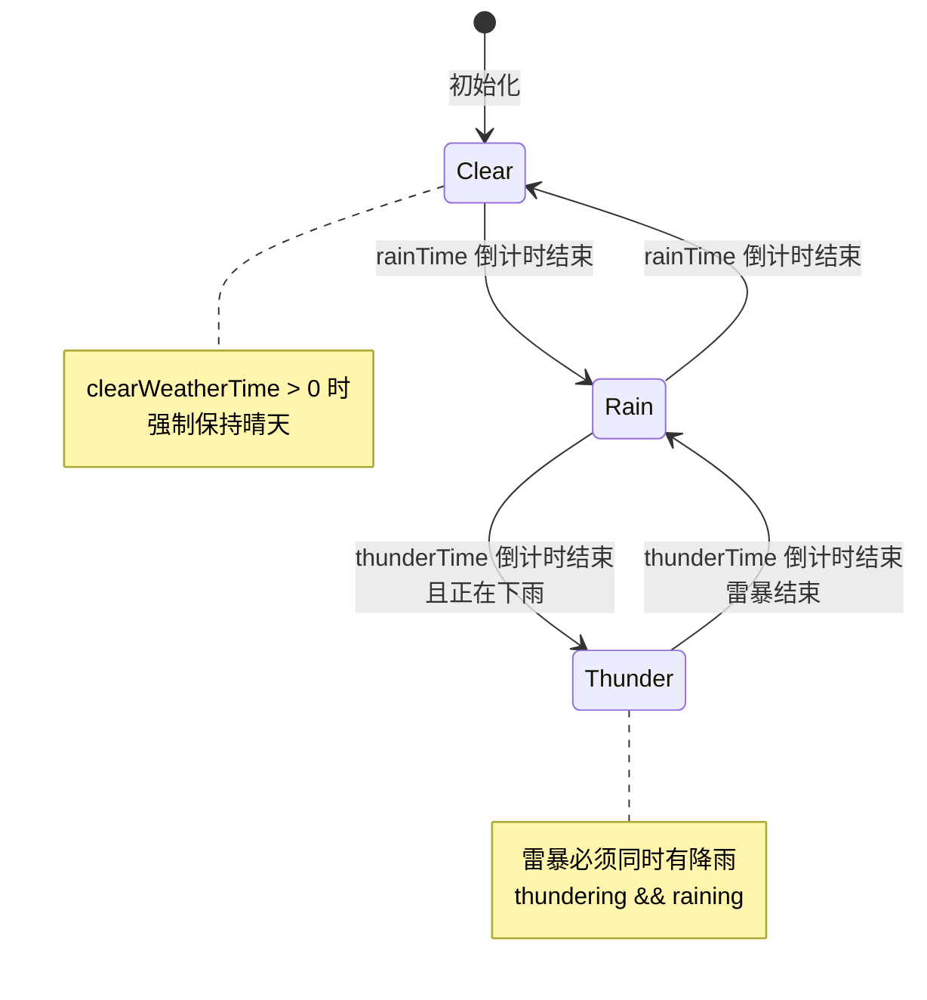

# WeatherManager 模块

服务端天气管理系统，负责管理世界天气状态、天气周期 tick 更新、闪电生成和天气同步通知。

## 目录结构

```
src/server/world/weather/
├── WeatherManager.hpp   # 天气管理器头文件
└── WeatherManager.cpp   # 天气管理器实现
```

## 文件详细说明

### WeatherManager.hpp

**职责**: 定义服务端天气管理器接口，管理世界天气状态。

**主要内容**:

| 类/类型 | 说明 |
|---------|------|
| `WeatherManager` | 服务端天气管理器主类 |
| `LightningSpawnCallback` | 闪电生成回调类型 |
| `WeatherChangeCallback` | 天气变化回调类型 |

**核心方法**:

| 方法 | 说明 |
|------|------|
| `initialize(seed)` | 初始化天气管理器 |
| `tick()` | 执行一个 tick，更新天气状态 |
| `setClear(duration)` | 设置晴天（/weather clear） |
| `setRain(duration)` | 设置降雨（/weather rain） |
| `setThunder(duration)` | 设置雷暴（/weather thunder） |
| `resetWeather()` | 重置天气（玩家睡觉后） |
| `trySpawnLightning()` | 尝试生成闪电 |
| `serialize/deserialize` | 世界存档序列化 |

### WeatherManager.cpp

**职责**: 实现天气管理器逻辑。

**核心实现**:

| 函数 | 说明 |
|------|------|
| `tickWeatherCycle()` | 处理天气周期逻辑 |
| `updateStrength()` | 更新天气强度渐变 |
| `checkWeatherChange()` | 检测天气变化并触发回调 |

## 模块关系图



## 整体职责

WeatherManager 模块负责：

1. **天气状态管理**: 维护世界当前的天气状态（晴天、降雨、雷暴）
2. **天气周期更新**: 自动推进天气计时器，处理天气状态切换
3. **强度渐变**: 实现平滑的天气强度过渡（每 tick 变化 0.01）
4. **命令处理**: 处理 `/weather` 命令请求
5. **闪电生成**: 雷暴时按概率生成闪电
6. **状态同步**: 通过回调通知其他系统天气变化

## 输入和输出

### 输入

| 输入来源 | 内容 |
|----------|------|
| `tick()` 调用 | 每个 game tick 的驱动 |
| `setClear/Rain/Thunder()` | 命令或事件触发的天气设置 |
| `resetWeather()` | 玩家睡觉后重置天气 |
| `setWeatherCycleEnabled()` | 游戏规则 `doWeatherCycle` |

### 输出

| 输出目标 | 内容 |
|----------|------|
| `WeatherState` | 当前天气状态数据 |
| `isRaining/isThundering()` | 天气状态查询 |
| `rainStrength/thunderStrength()` | 天气强度查询 |
| `hasWeatherChanged()` | 天气变化标志 |
| `WeatherChangeCallback` | 天气变化事件通知 |
| `LightningSpawnCallback` | 闪电生成事件通知 |
| `serialize()` | 世界存档数据 |

## 依赖项

### 外部依赖

| 依赖 | 用途 |
|------|------|
| `common/world/weather/WeatherState.hpp` | 天气状态数据结构 |
| `common/world/weather/WeatherConstants.hpp` | 天气常量定义 |
| `common/world/weather/WeatherUtils.hpp` | 天气工具函数 |
| `common/util/math/random/Random.hpp` | 随机数生成器 |
| `common/core/Result.hpp` | 错误处理 |
| `common/world/IWorld.hpp` | 世界接口（前向声明） |

### 被依赖

| 模块 | 用途 |
|------|------|
| `ServerWorld` | 持有 WeatherManager 实例 |
| `MinecraftServer` | 提供 weatherManager() 访问 |
| `WeatherCommand` | 执行 `/weather` 命令 |

## 使用方法

### 基本使用

```cpp
#include "server/world/weather/WeatherManager.hpp"

// 创建并初始化
mc::server::WeatherManager weatherManager;
weatherManager.initialize(seed);
weatherManager.setWorld(&world);  // 可选

// 主循环中调用 tick
while (running) {
    weatherManager.tick();

    // 检查天气变化
    if (weatherManager.hasWeatherChanged()) {
        broadcastWeatherUpdate();
    }
}
```

### 命令处理

```cpp
// /weather clear 300 (持续 300 秒 = 6000 ticks)
weatherManager.setClear(6000);

// /weather rain (默认 5 分钟)
weatherManager.setRain(0);

// /weather thunder (默认 5 分钟)
weatherManager.setThunder(0);
```

### 回调设置

```cpp
// 设置闪电生成回调
weatherManager.setLightningCallback([](const mc::BlockPos& pos) {
    spawnLightningEntity(pos);
});

// 设置天气变化回调
weatherManager.setWeatherChangeCallback([](WeatherType oldType, WeatherType newType) {
    broadcastWeatherChange(oldType, newType);
});
```

### 天气状态查询

```cpp
// 检查是否正在下雨（强度检查）
if (weatherManager.isRaining()) {
    // 正在下雨
}

// 获取插值后的降雨强度（用于渲染）
f32 strength = weatherManager.rainStrength(partialTick);

// 获取当前天气类型
WeatherType type = weatherManager.weatherType();
```

## 天气周期逻辑



## 天气强度渐变

天气强度用于平滑过渡渲染效果：

```
强度变化: 每tick ±0.01

raining = true:
  rainStrength → 1.0 (渐增)
raining = false:
  rainStrength → 0.0 (渐减)

thundering = true && raining = true:
  thunderStrength → 1.0 (渐增)
else:
  thunderStrength → 0.0 (渐减)

阈值:
  isRaining()     = rainStrength > 0.2
  isThundering()  = thunderStrength > 0.9
```

## 天气持续时间

| 天气类型 | 最短时间 | 最长时间 | MC 1.16.5 参考 |
|----------|----------|----------|----------------|
| 晴天 | 12000 ticks (10分钟) | 168000 ticks (140分钟) | 自然周期 |
| 降雨 | 12000 ticks (10分钟) | 24000 ticks (20分钟) | 自然周期 |
| 雷暴 | 3600 ticks (3分钟) | 15600 ticks (13分钟) | 自然周期 |
| 命令默认 | 6000 ticks (5分钟) | - | `/weather` 命令 |

## 容易踩的坑

### 1. 强度阈值判断

**问题**: 使用 `raining` 标志而不是 `isRaining()` 判断天气状态

```cpp
// 错误：状态标志可能已改变但强度还未达到阈值
if (weatherManager.state().raining) { ... }

// 正确：使用强度阈值判断
if (weatherManager.isRaining()) { ... }
```

**原因**: `isRaining()` 检查 `rainStrength > 0.2`，这比直接检查 `raining` 标志更准确，因为强度渐变有延迟。

### 2. 天气变化检测时机

**问题**: 在 `tick()` 之前检查 `hasWeatherChanged()`

```cpp
// 错误：可能错过上一帧的变化
if (weatherManager.hasWeatherChanged()) { ... }
weatherManager.tick();

// 正确：先 tick 再检查
weatherManager.tick();
if (weatherManager.hasWeatherChanged()) { ... }
```

### 3. 雷暴需要降雨

**问题**: 单独设置雷暴而不启用降雨

```cpp
// 错误：直接修改状态可能破坏不变量
state.thundering = true;
state.raining = false;  // 雷暴不会有视觉效果

// 正确：使用 setThunder() 自动启用降雨
weatherManager.setThunder(6000);  // 同时启用降雨和雷暴
```

### 4. clearWeatherTime 强制晴天

**问题**: 忽略 `clearWeatherTime` 的影响

```cpp
// 当 clearWeatherTime > 0 时，天气周期不会自然变化
// 即使 rainTime 或 thunderTime 倒计时结束
```

### 5. 天气周期禁用

**问题**: 设置 `weatherCycleEnabled = false` 后天气仍然变化

```cpp
// weatherCycleEnabled = false 只阻止自然天气周期
// 命令（setClear/setRain/setThunder）仍然有效
```

### 6. 序列化数据大小

**问题**: 反序列化时数据不足

```cpp
// 序列化数据大小为 23 字节
// 3 * i32 (12) + 3 * bool (3) + 2 * f32 (8) = 23 字节
```

## 涉及的测试用例

测试文件位于 `tests/server/weather/WeatherManagerTest.cpp`，共 25 个测试：

### WeatherState 测试 (12 个)

| 测试名称 | 验证内容 |
|----------|----------|
| `DefaultStateIsClear` | 默认状态为晴天 |
| `WeatherTypeReturnsCorrectValue` | 天气类型判断正确 |
| `IsRainingUsesThreshold` | 降雨判断使用阈值 |
| `IsThunderingUsesThreshold` | 雷暴判断使用阈值 |
| `GetRainStrengthInterpolates` | 降雨强度插值正确 |
| `GetThunderStrengthInterpolates` | 雷暴强度插值正确 |
| `ResetWeatherClearsAll` | 重置天气清除所有状态 |
| `CanSleepDuringThunder` | 雷暴时可睡觉 |
| `CanSleepDuringRainAtNight` | 降雨夜间可睡觉 |
| `CanSleepDuringClearNightOnly` | 晴天仅夜间可睡觉 |
| `SkyLightLimitDependsOnWeather` | 天空光照限制正确 |

### WeatherManager 测试 (13 个)

| 测试名称 | 验证内容 |
|----------|----------|
| `InitialStateIsClear` | 初始状态为晴天 |
| `SetClearStopsRainAndThunder` | 晴天命令停止降雨 |
| `SetRainStartsRaining` | 降雨命令开始降雨 |
| `SetThunderStartsRainAndThunder` | 雷暴命令同时启用降雨 |
| `SetClearWithDefaultDuration` | 默认晴天持续时间 |
| `SetRainWithDefaultDuration` | 默认降雨持续时间 |
| `SetThunderWithDefaultDuration` | 默认雷暴持续时间 |
| `ResetWeatherClearsAll` | 重置天气清除状态 |
| `StrengthTransitionsGradually` | 强度渐变正确 |
| `WeatherCycleDisabledDoesNotChangeWeather` | 禁用周期不变化 |
| `HasStrengthChangedDetectsChanges` | 强度变化检测 |
| `WeatherChangedCallbackIsCalled` | 回调被正确调用 |
| `SerializationRoundTrip` | 序列化往返正确 |
| `TrySpawnLightningOnlyDuringThunder` | 仅雷暴时生成闪电 |

### WeatherUtils 测试 (5 个)

| 测试名称 | 验证内容 |
|----------|----------|
| `GetPrecipitationTypeReturnsCorrectValue` | 降水类型判断正确 |
| `CalculateSkyDarkenFactor` | 天空暗化因子计算正确 |
| `CalculateCelestialVisibility` | 天体可见度计算正确 |
| `CalculateStarBrightness` | 星星亮度计算正确 |
| `GetRandomWeatherDurationInValidRange` | 随机时长在有效范围 |

### WeatherConstants 测试 (4 个)

| 测试名称 | 验证内容 |
|----------|----------|
| `DurationsAreSensible` | 持续时间合理 |
| `ThresholdsAreValid` | 阈值有效 |
| `StrengthChangeRateIsSmall` | 强度变化速率小 |
| `LightningChanceIsRare` | 闪电概率很低 |

## 相关文档

- [common/world/weather/README.md](../../../common/world/weather/README.md) - 通用天气模块
- [ServerWorld](../README.md) - 服务端世界管理
- [WeatherCommand](../../command/README.md) - 天气命令实现
