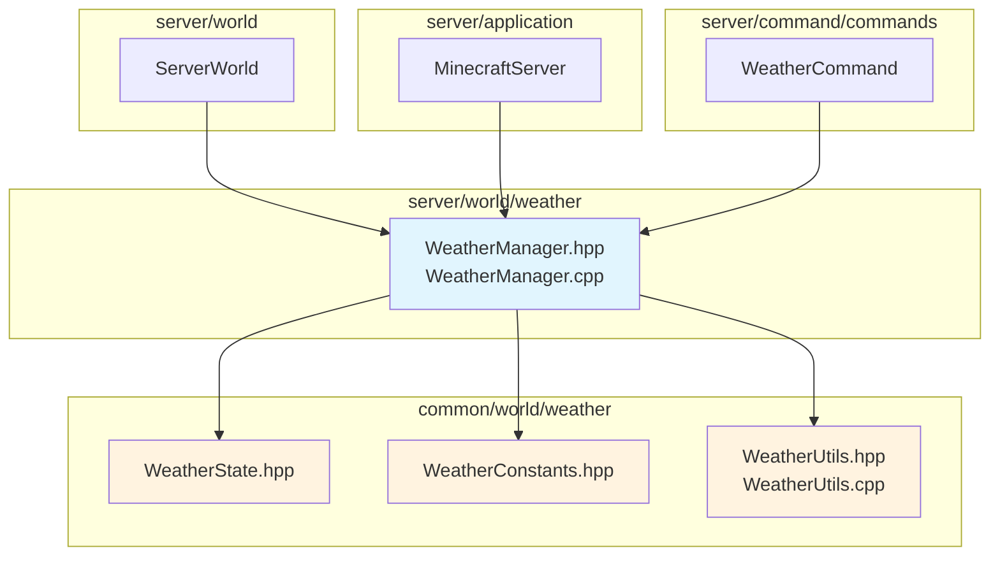

# WeatherManager 模块

服务端天气管理系统，负责管理世界天气状态、天气周期 tick 更新、闪电生成和天气同步通知。

## 目录结构

```
src/server/world/weather/
├── WeatherManager.hpp   # 服务端天气管理器头文件
└── WeatherManager.cpp   # 服务端天气管理器实现
```

## 模块关系图



## 上下游依赖关系

### 外部依赖

| 依赖 | 用途 |
|------|------|
| `common/world/weather/WeatherState.hpp` | 天气状态数据结构 |
| `common/world/weather/WeatherConstants.hpp` | 天气常量定义 |
| `common/world/weather/WeatherUtils.hpp` | 天气工具函数 |
| `common/util/math/random/Random.hpp` | 随机数生成器 |
| `common/core/Result.hpp` | 错误处理 |
| `common/world/IWorld.hpp` | 世界接口（前向声明） |

### 被依赖

| 模块 | 用途 |
|------|------|
| `ServerWorld` | 持有 WeatherManager 实例，调用 tick() |
| `MinecraftServer` | 提供 weatherManager() 访问 |
| `WeatherCommand` | 执行 `/weather` 命令 |

## 容易踩的坑

### 1. 强度阈值判断

使用 `raining` 标志而不是 `isRaining()` 判断天气状态会导致错误。`isRaining()` 检查 `rainStrength > 0.2`，这比直接检查 `raining` 标志更准确，因为强度渐变有延迟。

### 2. 天气变化检测时机

在 `tick()` 之前检查 `hasWeatherChanged()` 可能错过上一帧的变化。正确做法是先 tick 再检查。

### 3. 雷暴需要降雨

单独设置雷暴而不启用降雨不会有视觉效果。正确做法是使用 `setThunder()` 自动启用降雨。

### 4. clearWeatherTime 强制晴天

当 `clearWeatherTime > 0` 时，天气周期不会自然变化，即使 `rainTime` 或 `thunderTime` 倒计时结束。

### 5. 天气周期禁用

`weatherCycleEnabled = false` 只阻止自然天气周期，命令（setClear/setRain/setThunder）仍然有效。

### 6. 序列化数据大小

反序列化时数据大小固定为 23 字节：3 * i32 (12) + 3 * bool (3) + 2 * f32 (8) = 23 字节。
